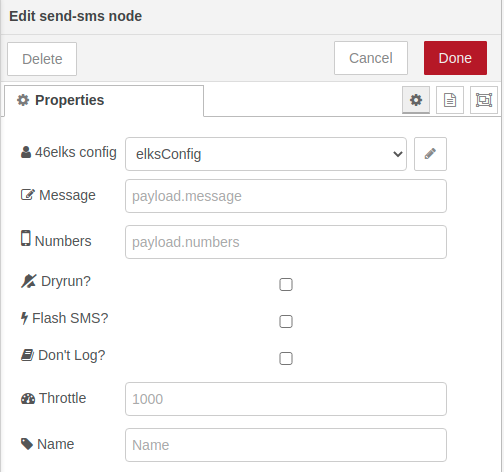

# [node-red-contrib-46elks][1]

[Node-Red][2] for interfacing with the [46elks][3] API. [46elks][3] offers SMS, MMS and Phone calls. Transparent pricing, no startup fees, no minimum monthly costs. In its current state this nodes only supports one-way SMS, but might in the future offer two-way SMS and MMS.   

## Features
* Full support of the 46elks' one-way SMS API.
* Feature to send bulk SMS message to several numbers. 

------------------------------------------------------------
# Nodes in Detail

## Start Using
1. Sign up for an account at [46elks.com/register-get-account][1]. 
   
2. Import the following flow into node-red.
    ```
    [{"id":"1276943a.ccdb0c","type":"inject","z":"c3bc17c8.36e3c8","name":"","props":[{"p":"payload"},{"p":"topic","vt":"str"}],"repeat":"","crontab":"","once":false,"onceDelay":0.1,"topic":"","payload":"","payloadType":"date","x":280,"y":460,"wires":[["9882a545.76dc18"]]},{"id":"eed869aa.0e8f98","type":"debug","z":"c3bc17c8.36e3c8","name":"","active":true,"tosidebar":true,"console":false,"tostatus":false,"complete":"true","targetType":"full","statusVal":"","statusType":"auto","x":690,"y":460,"wires":[]},{"id":"9882a545.76dc18","type":"send-sms","z":"c3bc17c8.36e3c8","name":"","message":"","numbers":"","dryrun":false,"flashsms":false,"dontlog":false,"throttle":"","elks":"","x":490,"y":460,"wires":[["eed869aa.0e8f98"]]}]
    ```


3. Create a new elksConfig by copy and paste the API Username and Password from the account page at [46elks.com/account][4]. Fill in the _From_ field with a name of your choosing. 
   


4. Fill in a random message, for example "Test" in the Message Field, ands a Number in E.164 format in the Number field. 



5.Inject a timestamp and wait for the SMS message to be delivered to your phone. 

------------------------------------------------------------

# To Do List

1. Add fields in msg.payload for dryrun, flash SMS, don't log and throttle. 
2. MMS functionality
3. SMS receive functionality 

------------------------------------------------------------

# Install

Run the following command in the root directory of your Node-RED install

    npm install node-red-contrib-46elks


# Tests

No tests for version 0.1.0

------------------------------------------------------------

# Version

0.1.0 base

------------------------------------------------------------

# Author

[David Rozenbeek][5]


[1]: https://46elks.com/register-get-account
[2]: https://nodered.org
[3]: https://46elks.se/
[4]: https://46elks.com/account
[5]: https://github.com/DacHt
